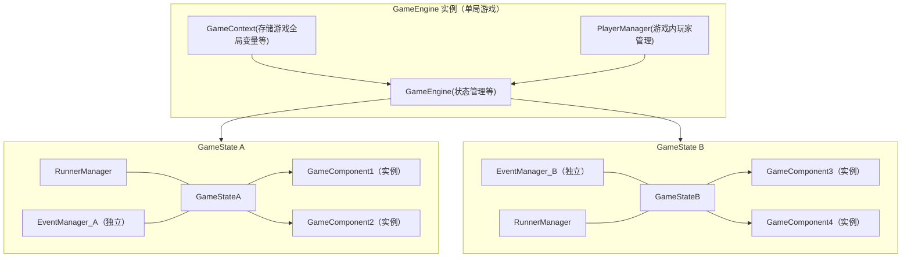
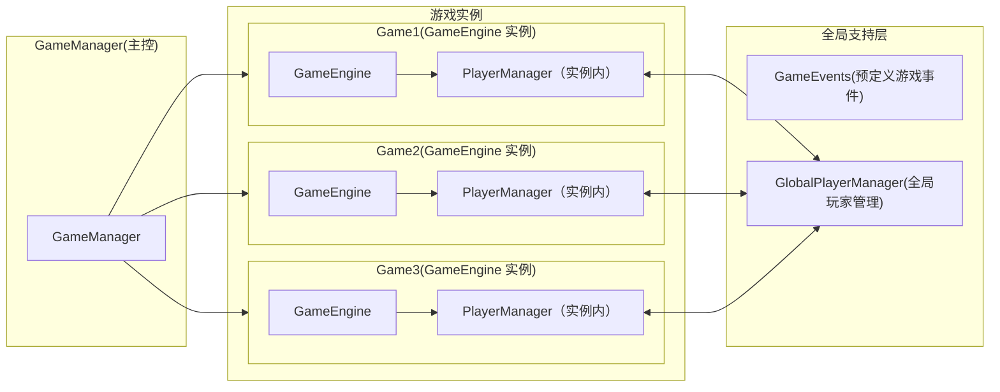

# SAPI-Game


> 使用纯 scriptApi 制作小游戏

[简体中文](./) | [English](./README.md)

---

## 目录

-   [安装与使用](#安装与使用)
-   架构
    -   [单局游戏架构](#单局游戏架构)
    -   [系统架构](#系统架构)
-   [文档与教程](#文档与教程)
-   [示例地图](#示例地图)
-   [反馈与交流](#反馈与交流)

## 安装与使用

推荐使用 npm+sapi-kit 进行项目构建,其它工具不做保证。

1.安装 sapi-kit

```shell
npm i sapi-kit
```

2.初始化

```shell
sapi-kit init
```

3.安装 SAPI-Game

```shell
npm i sapi-game
```

4.在入口文件中配置 SAPI-Game

示例(仅供参考，具体配置请按类型来)

```typescript
import { initSAPIGame } from "@sapi-game/main";
initSAPIGame({
    logLevel: logLevel.debug, //日志级别
    debugMode: true, //debugMode开关
    onEnd: onEnd, //执行/game end时触发
    hub: Hub, //玩家执行/hub时触发
    onJoin(p) {
        //玩家进入游戏时执行(可传送到大厅)
    },
});
```

## 架构

### 单局游戏架构



### 核心模块说明

#### GameEngine

控制游戏状态切换，持有全局 Context 与 PlayerManager。

-   ##### GameContext
    存储游戏上下文信息，如地图、规则、队伍等配置。
-   ##### PlayerManager
    管理游戏实例内的所有玩家。

#### GameState

定义游戏状态（等待、进行中、结束等），负责组件管理与状态逻辑。

-   ##### EventManager
    事件系统，生命周期与 State 一致，State 结束后自动清理。
-   ##### RunnerManager
    管理可取消的异步任务（scriptRunner），确保状态切换时安全中断。

#### GameComponent

功能组件，例如资源生成、地图刷新、边界控制等。组件可访问 Context、订阅事件、调用 Runner。

### 系统架构



### GameManager

管理游戏实例的启动与销毁，可同时维护多个实例，通过 key 区分。

### GameEvents

预定义通用事件（如 IntervalEventSignal、ButtonPushEventSignal 等），
可在 State 或 Component 中通过 eventManager 订阅。

### GlobalPlayerManager

全局玩家管理，负责玩家的分配和回收，游戏获取玩家时会从此尝试分配，游戏结束时会释放玩家。

## 文档与教程

[入门教程](./tutorial/入门.md)
[文档](./tutorial/文档.md)

## 示例地图

[PartyGames 地图]()

## 反馈与交流

-   反馈问题：请提交 Issue

-   功能合作：欢迎发 Pull Request

-   交流群：1004513100
