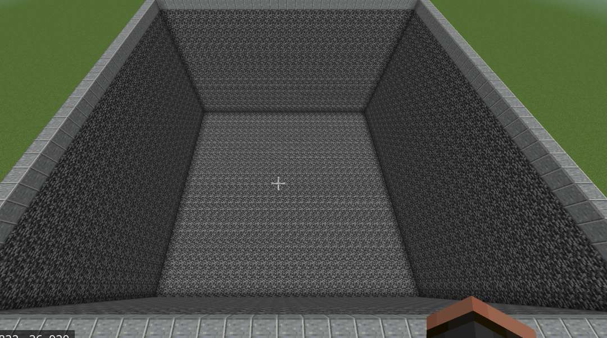
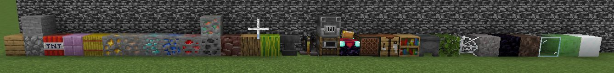
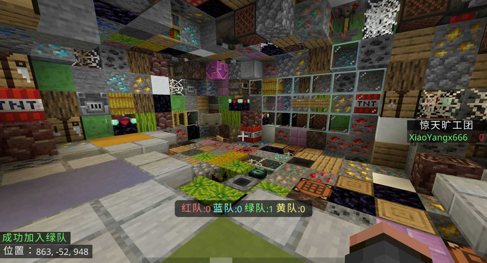

# 实战教程-惊天旷工团(1)

> 作者声明：本教程仅供参考，代码并非最优，可能有不规范之处。如有意见，欢迎提交 pr。

## 整体思路

此游戏主要流程是:选队->游戏开始->随机地图生成->游戏主阶段->结束

因此，我们分为四个 state

0. lobbyState(常驻)
   玩家选队、配置调整等
1. loadState
   随机生成地图
2. mainState
   玩家传送进入地图，结束检测等
3. endState
   播报胜利玩家，并回到等待大厅

其中，lobbyState 应该常驻，且不属于游戏本体。本教程不详细介绍，请参照[常驻游戏]()**(必看)**。

## 地图搭建

快速搭建出游戏地图及准备大厅


列出游戏中所有随机方块


## 创建游戏模块

创建 context,player,最后创建 module 和 game 类(只是创建，还无逻辑)

```typescript
export class BlockedInCombatContext extends GameContext {}
```

```typescript
//推荐继承TTLPlayer，也可继承GamePlayer
export class BlockedInCombatPlayer extends TTLPlayer {}
```

```typescript
import { createGameModule } from "@sapi-game/createGameModule";
import { BlockedInCombatPlayer } from "./player";
import { BlockedInCombatContext } from "./context";
export const BlockedInCombatModule = createGameModule({
    playerClass: BlockedInCombatPlayer,
    contextClass: BlockedInCombatContext,
});
```

```typescript
export class BlockedInCombat extends BlockedInCombatModule.Engine {
    protected override buildContext(config: unknown): BlockedInCombatContext {
        return new BlockedInCombatContext();
    }

    override onStart(): void {}

    override onStop(): void {}
}
```

## LobbyState

游戏第一个状态是选队，配置等，所以我们添加一个 lobbyState。

```typescript
export class BlockedLobbyState extends baseModule.State {
    override onEnter(): void {}
}
```

因为有四个队伍，所以创建一个 teams 对象，并初始化每个队伍。再创建一个 lobbyRegion 表示大厅范围。

另外，由于是常驻 state，我们希望它只在有人的时候才运行。所以使用 `lazyLoader`，在区块被加载时让 lobbyState 运行。

```typescript
//lobbyState.ts

// baseModule 是我们单独创建的模块，用于放置常驻 State（例如大厅）
// 它不参与游戏本体的生命周期
export class BlockedLobbyState extends baseModule.State {
    //队伍
    readonly teams = {
        red: new PlayerGroup(GamePlayer),
        blue: new PlayerGroup(GamePlayer),
        yellow: new PlayerGroup(GamePlayer),
        green: new PlayerGroup(GamePlayer),
    };
    readonly groupSet = new PlayerGroupSet(Object.values(this.teams));
    //大厅范围
    readonly lobbyRegion = new SphereRegion(
        DimensionIds.Overworld,
        { x: 868, y: -53, z: 945 },
        20
    );

    override onEnter(): void {
        // LazyLoader 组件：当玩家靠近时加载 Lobby 逻辑，离开时卸载，节省性能
        this.addComponent(LazyLoader, {
            dimensionId: DimensionIds.Overworld,
            pos: this.lobbyRegion.center, //等待大厅终点(观测点)
            onLoad: this.onLoad.bind(this), //加载
            onUnload: this.onUnload.bind(this), //卸载
        });
    }

    onLoad(loader: LazyLoader) {}

    onUnload() {
        Object.values(this.teams).forEach((t) => t.clear());
    }
}
```

然后添加选队功能，使用通用组件，`regionTeamChooser`。再加入`regionTeamCleaner`来清理离开区域的玩家。以及`TeamScoreBoard`。

> 这些通用组件功能如下：
>
> -   RegionTeamChooser: 玩家走进区域后自动加入队伍
> -   RegionTeamCleaner: 离开指定区域时移出队伍
> -   TeamScoreBoard: 计分板队伍显示

此外，还加入了 onJoin 方法，用于播放音效和刷新选队计分板(需要手动刷新)

以下是修改后的 onLoad 方法和 onJoin 方法

```typescript
//lobbyState.ts
onLoad(loader: LazyLoader) {
    //计分板显示选队
    loader.addComponent(TeamScoreBoard, {
        scoreboardName: "blocked_lobby",
        displayName: "惊天旷工团",
        teams: [
            { team: this.teams.red, prefix: "§c" },
            { team: this.teams.blue, prefix: "§b" },
            { team: this.teams.green, prefix: "§a" },
            { team: this.teams.yellow, prefix: "§e" },
        ],
    });
    //选队核心组件(玩家进入区域时选队)
    loader.addComponent(RegionTeamChooser, {
        config: [
            {
                team: this.teams.red,
                region: new CubeRegion(
                    DimensionIds.Overworld,
                    { x: 868, y: -52, z: 952 },
                    { x: 867, y: -52, z: 951 }
                ),
                onJoin: (p) => {
                    p.sendMessage(`§c成功加入红队`);
                    this.onJoin(p.player);
                },
            },
            {
                team: this.teams.blue,
                region: new CubeRegion(
                    DimensionIds.Overworld,
                    { x: 864, y: -52, z: 943 },
                    { x: 863, y: -52, z: 944 }
                ),
                onJoin: (p) => {
                    p.sendMessage(`§b成功加入蓝队`);
                    this.onJoin(p.player);
                },
            },
            {
                team: this.teams.green,
                region: new CubeRegion(
                    DimensionIds.Overworld,
                    { x: 864, y: -52, z: 947 },
                    { x: 863, y: -52, z: 948 }
                ),
                onJoin: (p) => {
                    p.sendMessage(`§a成功加入绿队`);
                    this.onJoin(p.player);
                },
            },
            {
                team: this.teams.yellow,
                region: new CubeRegion(
                    DimensionIds.Overworld,
                    { x: 866, y: -52, z: 940 },
                    { x: 865, y: -52, z: 939 }
                ),
                onJoin: (p) => {
                    p.sendMessage(`§e成功加入黄队`);
                    this.onJoin(p.player);
                },
            },
        ],
    });
    //玩家离开区域时清理
    loader.addComponent(RegionTeamCleaner, {
        region: this.lobbyRegion,
        teams: Object.values(this.teams),
    });
}

onJoin(player?: Player) {
   const sb = this.getComponent(TeamScoreBoard);
   sb.show();
   sb.refreshScoreBoard();
   player?.playSound("note.bell");
}
```

现在选队功能应该已经可以正常运行，但是游戏仍然无法开始。

所以我们可以添加一个 starter 组件。
组件中监听木牌点击事件，并显示各队伍人数(逻辑可移至其它位置)。
在木牌点击时，进入 handleStart 方法，进行判断并开始倒计时。
倒计时结束后，调用 state 的 start 方法来开始游戏。
ps:为了让组件加载，还需在 state 的 onLoad 方法中加入:`loader.addComponent(BlockedInCombatStarter)

```typescript
//starter.ts
export class BlockedInCombatStarter extends GameComponent<BlockedLobbyState> {
    private isCountingDown = false;
    private logger = new Logger(this.constructor.name);

    override onAttach(): void {
        //监听开始游戏木牌
        this.subscribe(Game.events.signClick, (t) => this.handleStart(t), {
            dimensionId: DimensionIds.Overworld,
            loc: { x: 872, y: -51, z: 945 },
            clickInterval: 5,
        });
        //显示各队伍人数
        this.subscribe(
            Game.events.interval,
            () => {
                const teams = this.state.teams;
                const cnt = mapObject(teams, (t) => t.validSize);
                this.state.lobbyRegion.forEachPlayer((p) => {
                    p.onScreenDisplay.setActionBar(
                        `§c红队:${cnt.red} §b蓝队:${cnt.blue} §a绿队:${cnt.green} §e黄队:${cnt.yellow}`
                    );
                });
            },
            new Duration(5)
        );
    }

    handleStart(t: PlayerInteractWithBlockBeforeEvent) {
        if (this.isCountingDown) {
            return t.player.sendMessage("不要重复开始");
        }
        if (!isReferee(t.player)) {
            t.player.sendMessage("你不是管理员，无权操作");
            return;
        }
        if (!this.state.canStartGameByPlayerCount()) {
            t.player.sendMessage("人数不足，无法开始");
            return;
        }
        if (Game.manager.hasGame(BlockedInCombat)) {
            return t.player.sendMessage("游戏已开始");
        }
        system.run(() => {
            this.startCountDown();
        });
    }

    //倒计时
    startCountDown() {
        this.state.deleteComponent(RegionTeamChooser); //暂时删除选队组件，使倒计时时选队失效
        this.isCountingDown = true;
        this.runner.run(async (r) => {
            try {
                for (let i = 5; i > 0; i--) {
                    this.state.groupSet.title(i.toString());
                    this.state.groupSet.forEach((p) =>
                        p.player.playSound("random.click")
                    );
                    await r.wait(20);
                }
                this.state.start(); //调用state的start方法
            } catch (err) {
                this.logger.error("开始游戏失败", err);
            } finally {
                this.isCountingDown = false;
            }
        });
    }
}
```

现在我们在 state 中添加如下代码。
start 中先检查人数(倒计时中可能有人退出导致人数不足)，再开始游戏。
调用 LazyLoader 的 reload 会重新加载所有组件，并执行 onUnload 方法(前面已经写了，作用是清空队伍玩家)。

```typescript
//lobbyState.ts

//检查人数是否足够
canStartGameByPlayerCount() {
   const teams = Object.values(this.teams);
   const validTeams = teams.filter((t) => t.validSize >= 1).length;

   return Game.config.config.debugMode ? validTeams > 0 : validTeams >= 2;
}

//开始游戏
start() {
    if (!this.canStartGameByPlayerCount()) {
        this.lobbyRegion.forEachPlayer((p) =>
            p.onScreenDisplay.setTitle("人数不足，已取消")
        );
    } else {
        Object.values(this.teams).forEach((t) => t.clearInvalid());//清除失效玩家
        Game.manager.startGame(BlockedInCombat);//开始游戏
    }
    this.getComponent(LazyLoader).reload();//重载
}
```

现在，在经过倒计时后，应该可以成功开始`BlockedInCombat`游戏，然而由于我们还没写游戏代码，所以不会有任何事情发生。

至此 lobbyState 的完整代码如下

```typescript
//lobbyState.ts
export class BlockedLobbyState extends baseModule.State {
    //队伍
    readonly teams = {
        red: new PlayerGroup(GamePlayer),
        blue: new PlayerGroup(GamePlayer),
        yellow: new PlayerGroup(GamePlayer),
        green: new PlayerGroup(GamePlayer),
    };
    readonly groupSet = new PlayerGroupSet(Object.values(this.teams));
    //大厅范围
    readonly lobbyRegion = new SphereRegion(
        DimensionIds.Overworld,
        { x: 868, y: -53, z: 945 },
        20
    );

    override onEnter(): void {
        this.addComponent(LazyLoader, {
            dimensionId: DimensionIds.Overworld,
            pos: this.lobbyRegion.center,
            onLoad: this.onLoad.bind(this),
            onUnload: this.onUnload.bind(this),
        });
    }

    onLoad(loader: LazyLoader) {
        loader.addComponent(TeamScoreBoard, {
            scoreboardName: "blocked_lobby",
            displayName: "惊天旷工团",
            teams: [
                { team: this.teams.red, prefix: "§c" },
                { team: this.teams.blue, prefix: "§b" },
                { team: this.teams.green, prefix: "§a" },
                { team: this.teams.yellow, prefix: "§e" },
            ],
        });

        loader.addComponent(RegionTeamChooser, {
            config: [
                {
                    team: this.teams.red,
                    region: new CubeRegion(
                        DimensionIds.Overworld,
                        { x: 868, y: -52, z: 952 },
                        { x: 867, y: -52, z: 951 }
                    ),
                    onJoin: (p) => {
                        p.sendMessage(`§c成功加入红队`);
                        this.onJoin(p.player);
                    },
                },
                {
                    team: this.teams.blue,
                    region: new CubeRegion(
                        DimensionIds.Overworld,
                        { x: 864, y: -52, z: 943 },
                        { x: 863, y: -52, z: 944 }
                    ),
                    onJoin: (p) => {
                        p.sendMessage(`§b成功加入蓝队`);
                        this.onJoin(p.player);
                    },
                },
                {
                    team: this.teams.green,
                    region: new CubeRegion(
                        DimensionIds.Overworld,
                        { x: 864, y: -52, z: 947 },
                        { x: 863, y: -52, z: 948 }
                    ),
                    onJoin: (p) => {
                        p.sendMessage(`§a成功加入绿队`);
                        this.onJoin(p.player);
                    },
                },
                {
                    team: this.teams.yellow,
                    region: new CubeRegion(
                        DimensionIds.Overworld,
                        { x: 866, y: -52, z: 940 },
                        { x: 865, y: -52, z: 939 }
                    ),
                    onJoin: (p) => {
                        p.sendMessage(`§e成功加入黄队`);
                        this.onJoin(p.player);
                    },
                },
            ],
        });
        loader.addComponent(RegionTeamCleaner, {
            region: this.lobbyRegion,
            teams: Object.values(this.teams),
        });
        loader.addComponent(BlockedInCombatStarter);
    }

    onJoin(player?: Player) {
        const sb = this.getComponent(TeamScoreBoard);
        sb.show();
        sb.refreshScoreBoard();
        player?.playSound("note.bell");
    }

    onUnload() {
        Object.values(this.teams).forEach((t) => t.clear());
    }

    canStartGameByPlayerCount() {
        const teams = Object.values(this.teams);
        const validTeams = teams.filter((t) => t.validSize >= 1).length;

        return Game.config.config.debugMode ? validTeams > 0 : validTeams >= 2;
    }

    start() {
        if (!this.canStartGameByPlayerCount()) {
            this.lobbyRegion.forEachPlayer((p) =>
                p.onScreenDisplay.setTitle("人数不足，已取消")
            );
        } else {
            Object.values(this.teams).forEach((t) => t.clearInvalid());
            Game.manager.startGame(BlockedInCombat);
        }
        this.getComponent(LazyLoader).reload();
    }
}
```

最终效果如下,聊天栏有加入信息显示，底部有队伍人数，右侧有计分板显示

