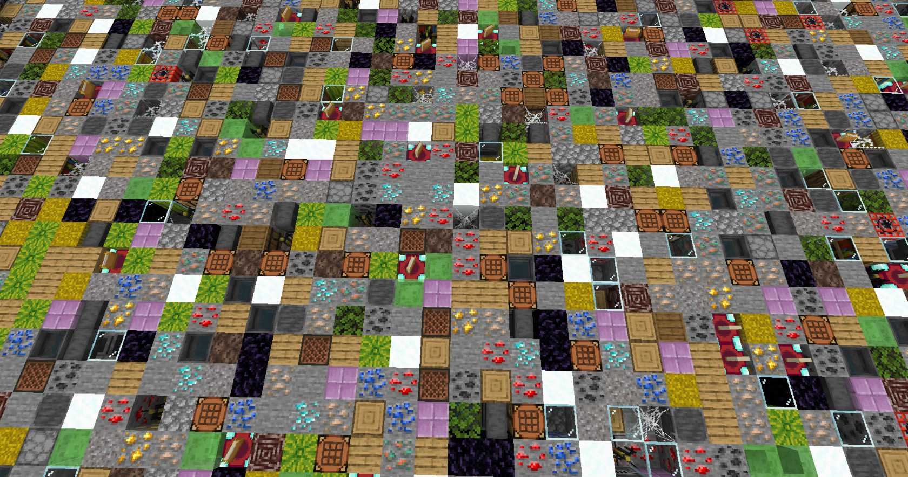

# 实战教程-惊天旷工团(3)

上章我们已经完成 context 中数据结构，现在我们可以开始做游戏了

## BlockedLoadState

首先创建 LoadState，这个状态用于生成地图的随机方块。

显然在刚进入状态时，我们需要把玩家 tp 到等待点，并设置出生点等。

接下来我们给状态加上一个专门负责生成地图的组件 —— BlockedRandomMapLoader(后文简称 loader)，所有和随机方块生成有关的逻辑后续都会写在里面。

```ts
//loadState.ts
export class BlockedLoadState extends BlockedInCombatModule.State {
    override onEnter(): void {
        this.initPlayer();
        this.addComponent(BlockedRandomMapLoader);
        //给药水效果
        this.subscribe(
            Game.events.interval,
            () => {
                this.context.groupSet.forEach((p) =>
                    p.addEffect(EffectIds.Resistance, 100, 255)
                );
            },
            new Duration(20)
        );
    }

    initPlayer() {
        this.context.groupSet.forEach((p) => {
            p.player.teleport(this.context.map.loadingPos);
            p.player.setSpawnPoint({
                dimension: Dimensions.Overworld,
                ...this.context.map.loadingPos,
            });
            p.player.setGameMode(GameMode.Adventure);
            p.clear();
            p.title("地图生成中...", this.context.map.name);
        });
    }

    stop(err: unknown) {
        this.logger.error("地图加载失败", err);
        this.engine.stopGame();
    }

    next() {
        this.transitionTo(BlockedMainState);
    }
}
```

为了处理加载失败和加载成功，创建了 stop 和 next 两个方法。当地图加载完成时，在 loader 中调用 next 方法而进入下一状态;而当地图加载遇到问题，则调用 stop 停止游戏。

## BlockedRandomMapLoader

先想一想加载流程：先清空地图再生成随机方块。
为此先写出基本框架如下:

### 基本框架

```ts
//mapLoader.ts
export class BlockedRandomMapLoader extends GameComponent<BlockedLoadState> {
    override onAttach(): void {
        this.runner.run(async (r) => {
            try {
                this.killAll();
                await r.wait(1);
                await this.fillAir(); //清空场地
                await r.wait(2);
                this.killAll();
                await this.randomBlocks();
                await r.wait(10);
                this.context.groupSet.title("地图生成完成");
                await r.wait(10);
                this.state.next();
            } catch (err) {
                this.context.groupSet.sendMessage("§c地图生成失败，游戏结束");
                this.state.stop(err);
            }
        });
    }

    private async fillAir() {
        const gen = regionHelper.fillGenerator(this.context.map.region, "air");
        const result = this.runner.runJob(gen);
        await result.promise;
    }

    private killAll() {
        const entites = this.context.map.region.getEntitesInRegion({
            excludeTypes: [EntityTypeIds.Player],
        });
        entites.forEach((e) => e.remove());
    }

    async randomBlocks() {
        //待补充
    }
}
```

在组件 onAttach 时，启动一个 runner 来执行异步。先杀死实体再 fillAir，然后再杀死实体(填充空气后掉落的)，这样就清空了场地。

> **regionHelper.fillGenerator**: 根据参数生成一个 generator，用指定方块填充立方体区域。这个 generator 可以用 runner.runJob 来执行。

> **runner**: 用于运行异步任务，它会在组件被卸载时停止继续执行。

### 方块数据

```ts
//blocks.ts

//接口
export interface BlockedInCombatBlockData {
    permutation?: BlockPermutation; //最终的BlockPermutation
    blockId?: string; //方块id
    buildBlock?: () => BlockPermutation; //自定义方块生成函数
    afterSet?: (block: Block) => void; //方块被放置后执行
    prob: number; //概率
}

export const BlockedInCombatBlocks: BlockedInCombatBlockData[] = [
    { blockId: "oak_planks", prob: 1.2 },
    { blockId: "cobblestone", prob: 1.2 },
    { blockId: "stone", prob: 1.2 },
    { blockId: "tnt", prob: 0.3 },
    { blockId: "purpur_block", prob: 1 },
    { blockId: "hay_block", prob: 1 },
    { blockId: "gold_ore", prob: 1.2 },
    { blockId: "iron_ore", prob: 1.2 },
    { blockId: "diamond_ore", prob: 1.1 },
    { blockId: "coal_ore", prob: 1.1 },
    { blockId: "lapis_ore", prob: 1.1 },
    { blockId: "redstone_ore", prob: 1.1 },
    { blockId: "copper_ore", prob: 1.1 },
    { blockId: "ancient_debris", prob: 1 },
    { blockId: "oak_log", prob: 1.2 },
    { blockId: "melon_block", prob: 1.2 },
    { blockId: "anvil", prob: 0.9 },
    { blockId: "brewing_stand", prob: 0.9 },
    { blockId: "furnace", prob: 0.8 },
    { blockId: "blast_furnace", prob: 0.9 },
    { blockId: "enchanting_table", prob: 0.8 },
    { blockId: "noteblock", prob: 0.7 },
    { blockId: "crafting_table", prob: 0.9 },
    { blockId: "bookshelf", prob: 1 },
    {
        //使用自定义函数生成含水的炼药锅
        buildBlock: () =>
            BlockPermutation.resolve("cauldron", { fill_level: 3 }),
        prob: 0.8,
    },
    { blockId: "oak_leaves", prob: 1.1 },
    { blockId: "web", prob: 1 },
    { blockId: "gravel", prob: 1 }, //沙砾
    { blockId: "obsidian", prob: 1 }, //黑曜石
    { blockId: "soul_sand", prob: 1 }, //灵魂沙
    { blockId: "glass", prob: 1 }, //玻璃
    { blockId: "slime", prob: 1 }, //史莱姆
    { blockId: "snow", prob: 1 }, //雪
    {
        blockId: "barrel",
        prob: 0.4,
        afterSet(block) {
            //在放置木桶后向木桶内添加物品
            const container = block.getComponent(
                BlockComponentTypes.Inventory
            )?.container;
            if (!container) return;
            const items = [
                new ItemStack("netherite_upgrade_smithing_template", 1),
                new ItemStack("blaze_rod", 2),
                new ItemStack("nether_wart", 2),
            ];
            items.forEach((item) => container.addItem(item));
        },
    },
];
```

### 方块抽取

有了如上的方块数据，我们还需要实现快速的按概率抽取方块(因为生成的方块很多)。有一个库可以做到，那就是`@keystonehq/alias-sampling`，它可以实现快速按概率抽取。

> **alias-sampling**
> 一个用来“加速按权重随机抽样”的算法。普通随机每次都要遍历全部概率，而 alias 方法预先建表后可以 O(1) 时间抽取，适合成千上万个方块的情况。

使用 alias-sampling 后的完整代码如下:

```ts
//mapLoader.ts
import sample from "@keystonehq/alias-sampling";
// 省略其它导入

export class BlockedRandomMapLoader extends GameComponent<BlockedLoadState> {
    private sampler?: {
        next: (numOfSamples?: number | undefined) => BlockedInCombatBlockData;
    }; //采样器

    override onAttach(): void {
        this.runner.run(async (r) => {
            try {
                await this.initBlocks(); //创建采样器
                this.killAll();
                await r.wait(1);
                await this.fillAir(); //清空场地
                await r.wait(2);
                this.killAll();
                await this.randomBlocks(); //生成随机方块
                await r.wait(10);
                this.context.groupSet.title("地图生成完成");
                await r.wait(10);
                this.state.next(); //进入下一阶段
            } catch (err) {
                this.context.groupSet.sendMessage("§c地图生成失败，游戏结束");
                this.state.stop(err); //停止游戏
            }
        });
    }

    private async fillAir() {
        const gen = regionHelper.fillGenerator(this.context.map.region, "air");
        const result = this.runner.runJob(gen);
        await result.promise;
    }

    private killAll() {
        const entites = this.context.map.region.getEntitesInRegion({
            excludeTypes: [EntityTypeIds.Player],
        });
        entites.forEach((e) => e.remove());
    }

    /**预处理**/
    private async initBlocks() {
        //从blocks.ts动态导入(也可改为静态导入)
        const blocks = (await import("../blocks")).BlockedInCombatBlocks;

        //构建所有的BlockPermutation
        blocks.forEach((b) => {
            if (b.permutation) return;
            b.permutation = b.buildBlock
                ? b.buildBlock()
                : BlockPermutation.resolve(b.blockId!);
        });

        //根据概率创建采样器
        this.sampler = sample(
            blocks.map((b) => b.prob),
            blocks
        );
    }

    /**随机方块**/
    async randomBlocks() {
        const gen = this.BatchBlockGenerator();
        const ans = this.runner.runJob(gen);
        await ans.promise;
    }

    *BatchBlockGenerator(batchSize = 256) {
        if (!this.sampler) return;
        const sampler = this.sampler;
        const region = this.context.map.region;
        const max = region.getMax();
        const min = region.getMin();
        const dim = world.getDimension(region.dimensionId);
        let cnt = 0;

        //遍历整个region
        for (let y = min.y; y <= max.y; y++) {
            for (let x = min.x; x <= max.x; x++) {
                for (let z = min.z; z <= max.z; z++) {
                    //在每个坐标按概率抽方块
                    let data = sampler.next();
                    const pos = { x, y, z };
                    dim.setBlockPermutation(pos, data.permutation!); //设置方块
                    if (data.afterSet) {
                        //执行afterSet代码(如果有)
                        const block = dim.getBlock(pos);
                        if (block) data.afterSet(block);
                    }
                    cnt++;
                    if (cnt >= batchSize) {
                        //cnt大于batchSize时yiled
                        cnt = 0;
                        yield;
                    }
                }
            }
        }
    }
}
```

在上面的代码中，我们引入了 alias-sampling，先用 initBlocks 预处理，创建了采样器。然后在 randomBlocks 方法中先构建生成器，再用 runner.runJob 运行生成器。

BatchBlockGenerator 是实际处理方块填充的函数。它遍历区域内所有坐标，对于每个坐标，都用采样器按概率抽一个方块来放置。每次处理一批(当前为 256 个)方块，然后由系统决定是否继续处理，可以防止生成过程中掉刻。

> 执行顺序：
>
> 1.  初始化方块数据（initBlocks）
> 2.  清空旧地图（fillAir）
> 3.  删除残留实体（killAll）
> 4.  生成随机方块（randomBlocks）
> 5.  通知生成完成并进入下一状态

最终生成效果如下:

