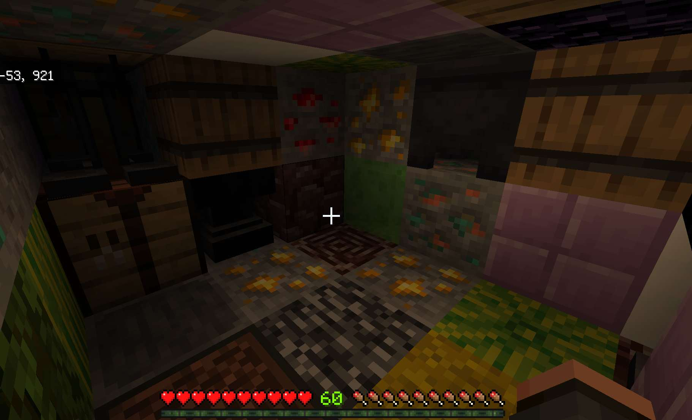
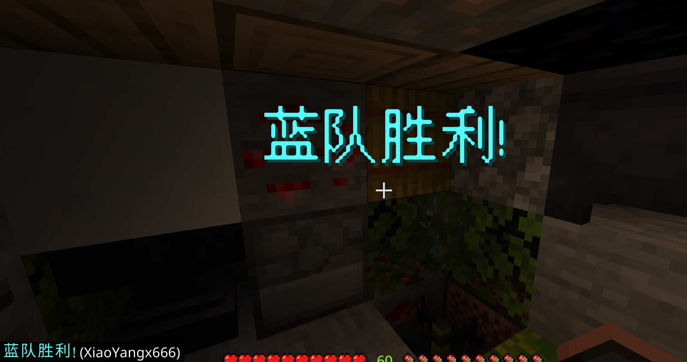

# 实战教程-惊天旷工团(4)

在本章教程中，我们将会完成 mainState 和 endState。

## BlockedMainState

在地图加载完成后，就会进入 mainState，在这个状态里，我们要实现出生点设置、死亡检测、区域限制以及结束检测。
为此，需要创建几个组件。

### mainState 组件

#### BlockedInCombatSpawnPoint 组件

这个组件用于为队伍设置重生点，并保护重生点。

```ts
//playerSpawn.ts
export class BlockedInCombatSpawnPoint extends GameComponent<BlockedMainState> {
    override onAttach(): void {
        this.initSpawnPoint();
        this.setPlayerSpawnPoint();

        this.subscribe(
            Game.events.interval,
            () => {
                this.setPlayerSpawnPoint();
                this.protectSpawnArea();
            },
            new Duration(10)
        );
        const protectedSpawnPoints = this.context.teams
            .filter((team) => team.data.spawnPoint)
            .map((team) => VectorUtils.below(team.data.spawnPoint!));
        //出生点保护
        this.subscribe(world.beforeEvents.playerInteractWithBlock, (t) => {
            const isProtected = protectedSpawnPoints.some((p) =>
                VectorUtils.isEqual(t.block.location, p)
            );
            if (isProtected) {
                t.cancel = true;
            }
        });
    }
}
```

首先在组件加载时，会随机为每个队伍分配重生点：先将 map 中定义的重生点打乱，再依次分配，遇到没有人的队伍会跳过不分配重生点。

```ts
private initSpawnPoint() {
    const teams = this.context.teams;
    const spawnPoints = RandomUtils.shuffle(this.context.map.spawnPoints);
    for (let i = 0; i < teams.length; i++) {
        if (teams[i].size == 0) continue;
        teams[i].data.spawnPoint = spawnPoints[i];
    }
}
```

然后为每个玩家设置重生点

```ts
setPlayerSpawnPoint() {
    this.context.teams.forEach((t) => {
        if (!t.data.spawnPoint) return;
        t.forEach((p) =>
            p.player.setSpawnPoint({
                dimension: Dimensions.Overworld,
                ...t.data.spawnPoint!,
            })
        );
    });
}
```

订阅了 interval 事件，循环保护出生点。

```ts
 /**保护出生点(设为空气) */
private protectSpawnArea() {
    this.context.teams.forEach((t) => {
        if (!t.data.spawnPoint) return;
        try {
            const dim = world.getDimension(
                this.context.map.region.dimensionId
            );
            dim.setBlockType(t.data.spawnPoint, "air");
        } catch (err) {}
    });
}
```

此外，组件中还包括了公共方法，用于让 state 调用。

```ts
/**把所有玩家传送到出生点**/
tpAllPlayersToSpawn() {
    this.context.teams.forEach((t) => {
        if (!t.data.spawnPoint) return;
        t.forEach((p) => p.player.teleport(t.data.spawnPoint!));
    });
}

/**重置重生点**/
resetAllSpawnAreas() {
    this.context.teams.forEach((t) => {
        if (t.data.spawnPoint) {
            this.resetSpawnArea(t.data.spawnPoint);
        }
    });
}

private resetSpawnArea(center: Vector3) {
    const max = VectorUtils.add(center, { x: 1, y: 1, z: 1 });
    const min = VectorUtils.subtract(center, { x: 1, y: 0, z: 1 });
    const dim = world.getDimension(this.context.map.region.dimensionId);
    dim.fillBlocks(new BlockVolume(max, min), "air");
    dim.setBlockType(VectorUtils.below(center), "bedrock");
}
```

调用 resetSpawnArea 后的重生点如下


#### BlockedInCombatRespawn 组件

这个组件用于监听玩家死亡，首先判断死亡实体是不是游戏中的玩家，再执行生命减少操作。最后广播死亡消息。

```ts
//respawn.ts
export class BlockedInCombatRespawn extends GameComponent<BlockedMainState> {
    override onAttach(): void {
        this.subscribe(world.afterEvents.entityDie, (event) => {
            const deadEntity = event.deadEntity;
            if (deadEntity.typeId !== EntityTypeIds.Player) return; //不是玩家，返回

            const result = this.context.groupSet.findById(deadEntity.id);
            if (!result) return; //游戏中找不到，返回

            const { player, group } = result;

            // 减少生命并处理观战模式
            if (player.live > 0) {
                player.live--; //生命减少
            }
            if (player.live <= 0) {
                player.player?.setGameMode(GameMode.Spectator); //死人改旁观
            }

            this.broadcastDeathMessage(
                player,
                group.data,
                event.damageSource.damagingEntity
            ); //广播死亡消息
        });
    }

    private broadcastDeathMessage(
        player: BlockedInCombatPlayer,
        teamData: BlockedTeamData,
        source?: Entity
    ) {
        const killerName = this.getKillerName(source);

        const playerName = this.buildColorerName(teamData, player);
        const message = killerName
            ? `${playerName} §r 被 ${killerName} §r 杀死了 (剩余 ${player.live} 命)`
            : `${playerName} §r 去世了 (剩余 ${player.live} 命)`;

        this.context.groupSet.sendMessage(message);
    }

    private getKillerName(source?: Entity): string | undefined {
        if (!source || source.typeId !== EntityTypeIds.Player) return undefined;

        const result = this.context.groupSet.findById(source.id);
        if (!result) return undefined;

        return this.buildColorerName(result.group.data, result.player);
    }

    private buildColorerName(
        team: BlockedTeamData,
        player: BlockedInCombatPlayer
    ) {
        return `${BlockedTeamColorMap[team.color].color}${player.name}`;
    }
}
```

组件效果如下:


#### BlockedInCombatDaemon 组件

本组件进行了结束检测。

```ts
//daemon.ts
export class BlockedInCombatDaemon extends GameComponent<BlockedMainState> {
    override onAttach(): void {
        //循环
        this.subscribe(
            Game.events.interval,
            () => {
                this.checkEnd();
            },
            new Duration(20)
        );
    }

    checkEnd() {
        // 获取每个队伍中存活且有效的玩家列表
        const activeTeams = this.context.teams.filter((team) =>
            team.find((player) => player.live > 0 && player.isValid)
        );

        // 如果只剩一个或没有活队伍，结束游戏
        if (activeTeams.length <= 1) {
            this.state.end(activeTeams[0]);
        }
    }
}
```

#### BlockedPortalCleaner 组件

本组件用于防止玩家进入地狱。会把玩家附近的地狱门替换成空气。

```ts
//portalCleaner.ts
export class BlockedPortalCleaner extends GameComponent<BlockedMainState> {
    readonly PORTAL_OFFSETS = [
        { x: 1, y: 0, z: 0 },
        { x: -1, y: 0, z: 0 },
        { x: 0, y: 0, z: 1 },
        { x: 0, y: 0, z: -1 },
    ];

    override onAttach(): void {
        this.subscribe(
            Game.events.interval,
            () => this.clearPortal(),
            new Duration(40)
        );
    }

    clearPortal() {
        for (const p of this.context.groupSet.getAllValidPlayers()) {
            if (p.live <= 0) continue;

            const player = p.player;
            const dim = player.dimension;
            const loc = player.location;

            for (const offset of this.PORTAL_OFFSETS) {
                try {
                    const pos = VectorUtils.add(loc, offset);
                    const block = dim.getBlock(pos);
                    if (block?.typeId === "minecraft:portal") {
                        block.setType("air");
                    }
                } catch (err) {}
            }
        }
    }
}
```

### mainState 本体

组件写完了，本体就比较简单了。首先添加所有组件(`PlayerHealthIndicator` 是通用组件)。

init 方法调用`BlockedInCombatSpawnPoint`组件，清空了重生点附近方块，并把玩家 tp 到了队伍的重生点。

end 方法供 daemon 组件调用，游戏结束时传入剩余队伍，将 context.winner 设置为剩余队伍，以便 endState 使用。

```ts
export class BlockedMainState extends BlockedInCombatModule.State {
    override onEnter(): void {
        this.addComponent(BlockedInCombatSpawnPoint)
            .addComponent(BlockedInCombatRespawn)
            //血量显示组件，用于在玩家名字下方显示血量
            .addComponent(PlayerHealthIndicator, {
                scoreBoardName: "healthIndicator",
                displayName: "§c血量",
                refreshInterval: new Duration(10),
            })
            .addComponent(BlockedInCombatDaemon)
            .addComponent(BlockedPortalCleaner).
            //限制玩家区域
            //PlayerRegionMonitor组件可以在玩家离开区域时执行设定的代码
            .addComponent(PlayerRegionMonitor, {
                region: this.context.map.region,
                onLeave(player) {
                    player.player?.kill();
                },
                interval: new Duration(10),
                groups: this.context.groupSet,
            });
        this.init();
    }

    init() {
        const spawn = this.getComponent(BlockedInCombatSpawnPoint);
        const healthIndicator = this.getComponent(PlayerHealthIndicator);
        spawn.resetAllSpawnAreas();
        spawn.tpAllPlayersToSpawn();
        this.context.groupSet.forEach((p) => {
            p.live = this.context.config.liveCnt; //初始化生命数
            p.player.setGameMode(GameMode.Survival);
            p.title("开战");
            p.player.resetLevel();
            p.player.addLevels(60);
        });
        healthIndicator.show();
        //设置游戏规则
        world.setDifficulty(Difficulty.Normal);
        world.gameRules.fallDamage = true;
        world.gameRules.pvp = true;
    }

    end(team?: PlayerGroup<BlockedInCombatPlayer, BlockedTeamData>) {
        if (this.context.winner) return;
        this.context.winner = team;
        this.transitionTo(BlockedEndState);
    }
}
```

context 类中需要加入 winner 属性

```ts
//context.ts
export class BlockedInCombatContext extends GameContext {
    readonly teams: PlayerGroup<BlockedInCombatPlayer, BlockedTeamData>[];
    readonly groupSet: PlayerGroupSet<BlockedInCombatPlayer, BlockedTeamData>;
    readonly map: BlockedInCombatMap;
    readonly config: BlockedInCombatConfig;

    //添加winner
    winner?: PlayerGroup<BlockedInCombatPlayer, BlockedTeamData>;

    constructor(
        teams: PlayerGroup<BlockedInCombatPlayer, BlockedTeamData>[],
        config: BlockedInCombatConfig
    ) {
        //省略
    }
}
```

## BlockedEndState

结束阶段非常简单，只需要显示胜者，然后结束游戏即可。

```ts
export class BlockedEndState extends BlockedInCombatModule.State {
    override onEnter(): void {
        this.showWinner();
        //延迟2s结束游戏
        this.runner.runDelay(() => {
            this.engine.stopGame();
        }, 40);
    }

    showWinner() {
        const winner = this.context.winner;
        if (winner === undefined) {
            this.context.groupSet.title("无人胜利");
            return;
        }
        const color = BlockedTeamColorMap[winner.data.color];
        this.context.groupSet.title(`${color.color}${color.name}胜利!`);
        this.context.groupSet.sendMessage(
            `${color.color}${color.name}胜利!§r (${winner
                .getAll()
                .map((p) => p.name)
                .join(",")})`
        );
    }
}
```

效果:

