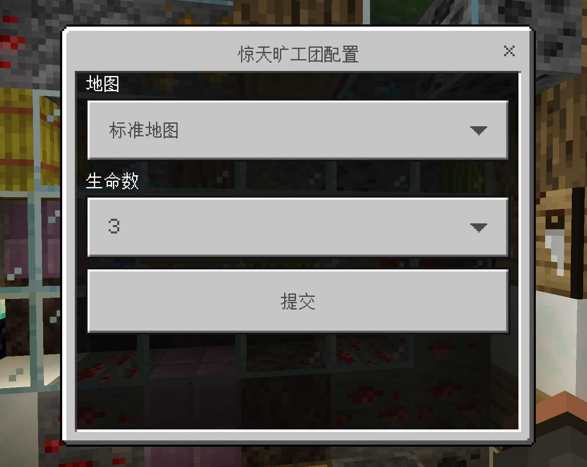

# 实战教程-惊天旷工团(5)

本章为游戏添加配置功能。

第二章中，lobbyState.start 方法中，我们传入了固定的配置。然而，实际游戏却常常需要修改配置。

```ts
//lobbyState.ts
start() {
    if (!this.canStartGameByPlayerCount()) {
        this.lobbyRegion.forEachPlayer((p) =>
            p.onScreenDisplay.setTitle("人数不足，已取消")
        );
    } else {
        Object.values(this.teams).forEach((t) => t.clearInvalid());
        //需要修改
        Game.manager.startGame(BlockedInCombat, {
            teams: Object.entries(this.teams),//传入玩家组entries
            config: {mapIndex:0,liveCnt:3},// 指定游戏配置
        });

    }
    this.getComponent(LazyLoader).reload();
}
```

## ConfigManager 组件

我们向 lobbyState 添加一个组件，configManager，用来管理配置项。

配置存储在动态数据中，此处为了方便，我们直接使用 SAPI-Pro 的 Configdb。(手动写也可以，需要 JSON.parse 等)

在 onAttach()中，订阅了木牌的点击事件，玩家点击木牌后为他展示配置表单。

```ts
//configManager.ts
import { Configdb } from "sapi-pro";
//其它引入省略

const defaultConfig: BlockedInCombatConfig = {
    mapIndex: 0,
    liveCnt: 3,
};

export class BlockedConfigManager extends GameComponent<BlockedLobbyState> {
    private readonly db = Configdb;
    private readonly configKey = "BlockedInCombat_Config";
    private isAttached = true;

    override onAttach(): void {
        this.subscribe(
            Game.events.signClick,
            (t) => {
                if (!isReferee(t.player)) {
                    return t.player.sendMessage("你无权配置此项");
                }
                system.run(() => {
                    this.showConfigForm(t.player);
                });
            },
            {
                dimensionId: DimensionIds.Overworld,
                loc: { x: 872, y: -51, z: 946 },
                clickInterval: 5,
            }
        );
    }

    override onDetach(): void {
        this.isAttached = false;
    }

    getConfig() {
        //待补充
    }

    private setConfig(config: BlockedInCombatConfig) {
        //待补充
    }

    private validateConfig(config: BlockedInCombatConfig) {
        //待补充
    }

    private showConfigForm(player: Player) {
        //待补充
    }
}
```

为了管理配置，我们先写`getConfig`和`setConfig`方法。
setConfig 前需要先验证数据，以确保没有问题。

```ts
getConfig() {
    //获取配置，没有的话就是默认配置
    return (this.db.getJSON(this.configKey) ??
        defaultConfig) as BlockedInCombatConfig;
}

private setConfig(config: BlockedInCombatConfig) {
    this.validateConfig(config);//先验证
    this.db.setJSON(this.configKey, config);
}

/**验证**/
private validateConfig(config: BlockedInCombatConfig) {
    if (!config) throw new Error("config为空");
    if (config.mapIndex == undefined || config.liveCnt == undefined) {
        throw new Error("有空项目");
    }
    if (!isNum(config.liveCnt)) {
        throw new Error("生命必须为数字类型");
    }
    if (!isNum(config.mapIndex)) {
        throw new Error("地图index必须为数字类型");
    }
}
```

然后写`showConfigForm`。它先用`getConfig`获取到当前配置，作为默认项，然后构建表单，向玩家展示。
玩家点击木牌后先判断有没有值，再判断`isAttached`，即组件是否仍然有效。最后去 setConfig。

> `isAttached`的作用是防止组件卸载后玩家仍能修改配置,在此处的作用不明显。但在狼人杀等游戏中，你肯定不希望天亮了女巫还能用药吧。

```ts
 private showConfigForm(player: Player) {
        const config = this.getConfig();
        const form = new ModalFormData()
            .title("惊天旷工团配置")
            .dropdown(
                "地图",
                BlockedInCombatMaps.map((m) => m.name),
                { defaultValueIndex: config.mapIndex }
            )
            .dropdown("生命数", ["1", "2", "3", "4", "5"], {
                defaultValueIndex: config.liveCnt - 1,
            });
        //展示
        form.show(player).then((ans) => {
            if (!ans.formValues) return;
            if(!this.isAttached)return;
            try {
                this.setConfig({
                    mapIndex: ans.formValues[0] as number,
                    liveCnt: (ans.formValues[1] as number) + 1,
                });
                player.sendMessage("配置成功");
            } catch (err) {
                player.sendMessage(
                    err instanceof Error ? err.message : "未知错误"
                );
            }
        });
    }
```

## 修改 lobbyState

现在，让我们修改 lobbyState，加入获取配置的功能。

```ts
export class BlockedLobbyState extends baseModule.State {
    //队伍
    readonly teams = {
        red: new PlayerGroup(GamePlayer),
        blue: new PlayerGroup(GamePlayer),
        yellow: new PlayerGroup(GamePlayer),
        green: new PlayerGroup(GamePlayer),
    };
    readonly groupSet = new PlayerGroupSet(Object.values(this.teams));
    //大厅范围
    readonly lobbyRegion = new SphereRegion(
        DimensionIds.Overworld,
        { x: 868, y: -53, z: 945 },
        20
    );

    override onEnter(): void {
        this.addComponent(LazyLoader, {
            dimensionId: DimensionIds.Overworld,
            pos: this.lobbyRegion.center,
            onLoad: this.onLoad.bind(this),
            onUnload: this.onUnload.bind(this),
        });
    }

    onLoad(loader: LazyLoader) {
        loader.addComponent(TeamScoreBoard, {
            //配置略
        });
        loader.addComponent(RegionTeamCleaner, {
            region: this.lobbyRegion,
            teams: Object.values(this.teams),
        });
        loader
            .addComponent(BlockedInCombatStarter)
            .addComponent(BlockedConfigManager); //在此处加入BlockedConfigManager
    }

    /**略**/

    start() {
        if (!this.canStartGameByPlayerCount()) {
            this.lobbyRegion.forEachPlayer((p) =>
                p.onScreenDisplay.setTitle("人数不足，已取消")
            );
        } else {
            Object.values(this.teams).forEach((t) => t.clearInvalid());
            //改为从configManager获取配置
            const config = this.getComponent(BlockedConfigManager).getConfig();
            Game.manager.startGame(BlockedInCombat, {
                teams: Object.entries(this.teams),
                config: config,
            });
        }
        this.getComponent(LazyLoader).reload();
    }
}
```

现在我们可以修改配置，并且支持多张地图。效果如下；


