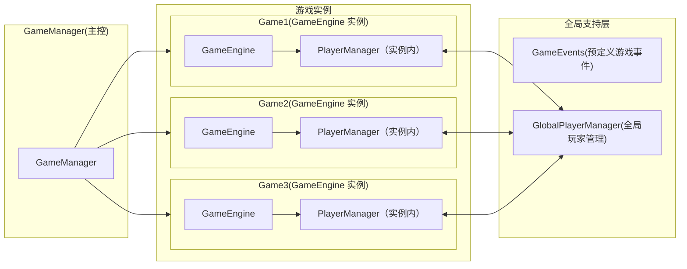
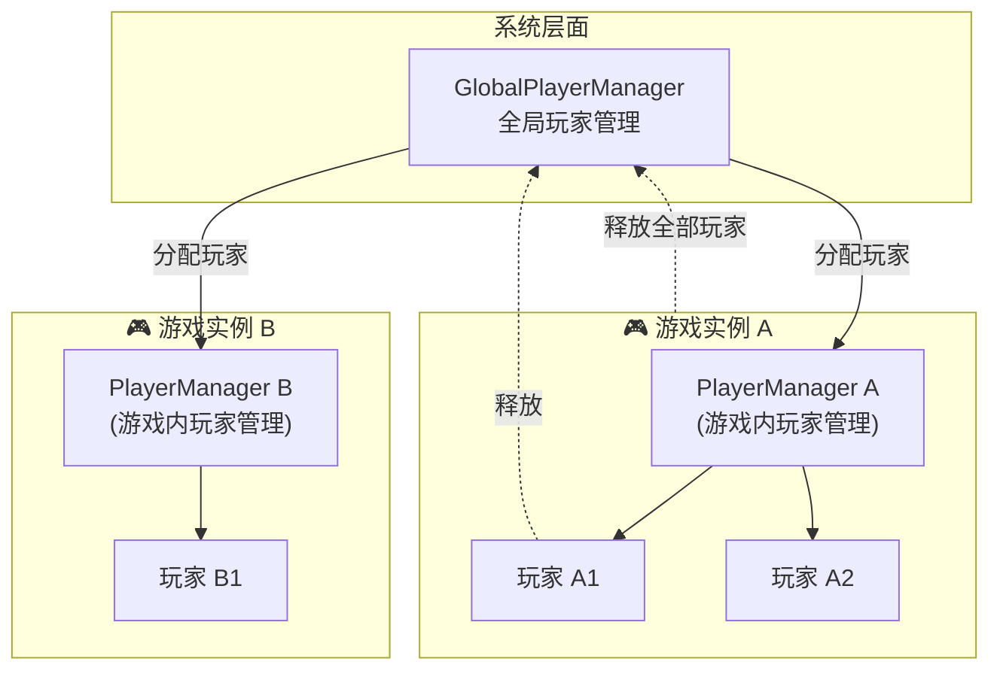
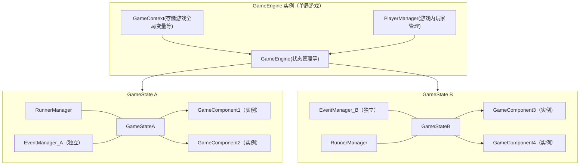

# SAPI-Game 架构解析

在本教程中，将会解析 SAPI-Game 的架构，理解架构有助于掌握小游戏的运行机制，帮助开发。

## 系统架构



### [GameManager](../docs/classes/GameManager.md)

SAPI-Game 支持同时运行多个不同游戏实例，也支持运行同一游戏的多个实例。这是由 GameManager 提供的。

GameManager 是游戏管理的核心，它的作用包括：控制游戏的开始、结束及结束所有游戏等。

可以通过`Game.manager`获得 GameManager 的实例。([Game 对象](../docs/variables/Game.md))

**GameManager 的部分方法**(泛型已省略)

-   `startGame(game: classConstructor<T>, config?: C, tag?: string)`
    启动指定游戏(可以指定 tag，默认标签为 '0')
-   `hasGame(game: classConstructor<T>,tag?: string):boolean`
    判断指定 tag 的游戏是否存在
-   `stopGame(game: classConstructor<T>,tag?: string)`
    停止指定 tag 的游戏

通过 GameManager，可以方便的管理游戏实例。

### [GameEvents](../docs/classes/gameEvents.md)

提供了一系列常用的游戏事件，可以在游戏内订阅使用。例如按钮按下事件可用于游戏的开始按钮，物品使用事件可用于监听游戏道具。

它们封装了原版事件，使得监听常用事件更加容易。

目前已有的事件包括:
`IntervalEventSignal`:循环事件，最常用
`ButtonPushEventSignal`:按钮按下事件(用于监听固定位置的按钮)
`SignClickEventSignal`:木牌点击事件(用于监听固定位置的木牌)
`ItemUseEventSignal`：指定物品使用事件
`PlayerRegionEventSignal`:玩家区域事件(监听玩家进入/离开区域)
`PlayerOnBlockEventSignal`:玩家在指定方块上触发
`PlayerItemInSlotEventSignal`:玩家指定槽位出现指定物品事件

### [GlobalPlayerManager](../docs/classes/globalPlayerManager.md)

在系统层面，有 GlobalPlayerManager 负责全局玩家管理，而在每个游戏中有 PlayerManager (后面讲，别急) 负责游戏内玩家管理。

GlobalPlayerManager 主要作用是为游戏分配玩家，并防止一个玩家同时被分配给两个游戏实例。

当游戏申请指定玩家时，GlobalPlayerManager 会尝试分配该玩家，如果该玩家已失效或被其它游戏占用，那么就不会分配成功。(分配失败会怎么样，后面讲)

游戏过程中，当玩家手动退出游戏时，会强制释放玩家，此时对游戏而言，玩家就失效了。

当游戏结束时，会请求 GlobalPlayerManager 释放分配给该游戏的所有玩家，玩家重新变为空闲。

图解:



GlobalPlayerManager 也提供了一些方法用于管理玩家，但一般用不到。
`getFreePlayers:Player[]`:获取所有空闲玩家

> 使用命令`/game status`可以查看当前游戏运行状态与玩家分配情况

## 单游戏架构



### [GameEngine](../docs/classes/GameEngine.md)

GameEngine 是每个游戏实例的核心运行单元，它负责游戏状态的切换与管理，同时维持游戏的运行上下文（context）和玩家管理器（PlayerManager）

所有游戏实例都由 GameManager 统一创建与控制，而 GameEngine 则专注于单个游戏内部的逻辑。

#### 生命周期与核心方法

GameEngine 定义了若干抽象方法:

-   `buildContext`
    用于创建游戏的上下文对象(context)

    > 该方法在 GameEngine 构造函数中调用，此时你可以直接通过 playerManager 获取玩家信息。

-   `onStart`
    游戏开始时执行，可加入游戏的初始状态等
-   `onStop`
    游戏结束时执行，通常用于清理资源、重置玩家状态或保存结果。

还有方法`stopGame()`用来停止当前游戏。

#### GameEngine 的状态管理

GameEngine 使用一个**状态数组**来维护游戏当前的运行状态。
这个数组既可以当作**栈**使用，也可以当作**普通列表**使用，取决于游戏的结构和需求。

##### 作为「状态栈」使用

当游戏逻辑是「一层进入一层退出」的流程（如准备 → 游戏中 → 结算），可以像使用栈一样操作：

-   `pushState(stateType: S,config?: ExtractConfig<S>)`:向栈顶添加状态
-   `popState()`:移除栈顶状态
-   `getNextState(state: GameState<P, C>)`:获取指定状态的下一个状态
-   `getLastState(state: GameState<P, C>)`:获取指定状态的上一个状态
-   `replaceFrom(stateToReplace: GameState<P, C>,newStateType: S,config?: ExtractConfig<S>)`:从指定的状态实例开始替换状态

##### 作为「普通数组」使用

当你需要在多个状态间随机访问、删除或修改时，也可以像普通列表一样操作：

-   `getState(stateType: classConstructor<T>)`:获取指定状态
-   `deleteState(stateType: gameStateConstructor<P, C, any>)`:删除指定状态

在实际开发中，GameEngine 的状态数组通常同时承担栈式管理与列表式访问的功能：

### [GameContext](../docs/classes/GameContext.md)

游戏上下文，用于存储游戏的配置、玩家组、地图、全局状态等数据。

下方示例是色盲派对游戏的上下文，其中存储了参与游戏的玩家组，游戏回合，获胜者。并通过构造函数传入了玩家和配置。

```ts
export class pixelPartyContext extends GameContext {
    readonly players: PlayerGroup<pixelPartyPlayer>;
    readonly map: PixelPartyMap;
    round: number = 0;
    winner?: pixelPartyPlayer;

    constructor(
        players: PlayerGroup<pixelPartyPlayer>,
        config: { map: PixelPartyMap }
    ) {
        super();
        this.players = players;
        this.map = config.map;
    }
}
```

### [PlayerManager](../docs/classes/GamePlayerManager.md)

PlayerManager 是游戏实例内的玩家管理器，负责管理该游戏中所有玩家对象。

它是游戏内部获取玩家的唯一入口。所有带有自定义数据的玩家对象（GamePlayer 或其子类）都由 PlayerManager 统一创建与维护。

#### 管理玩家对象

在游戏中，玩家对象通常不仅仅是一个实体，还需要附带额外的游戏数据。
例如，一个玩家在游戏中可能需要记录得分、状态等。

```ts
//示例:附带数据的玩家类
export class BlockedInCombatPlayer extends TTLPlayer {
    live: number = 1;
}
```

这样的自定义玩家类由 PlayerManager 负责创建和维护。

#### 玩家获取

要想获取游戏玩家对象，要调用`PlayerManager`中的`get(p: Player)`方法。

调用流程如下：

1. PlayerManager 检查该玩家是否已经在当前游戏中存在对应对象；

2. 若不存在或对象已失效，则会尝试向 GlobalPlayerManager 申请分配该玩家；

3. 若分配成功，返回一个有效的游戏玩家对象；

4. 若分配失败（玩家被其他游戏占用或离线），仍会返回一个玩家对象，但该对象处于"失效"状态。

总之，该方法会得到所申请的游戏玩家对象，可能是失效的。
通常，这个方法只在构造 context 时用到，因为游戏开始后，游戏内的玩家一般就固定了。

> 💡 "失效的玩家对象"意味着它在当前游戏中不可用，玩家离线、在其他游戏、被手动释放等都会导致玩家失效。

#### 玩家失效

当玩家手动退出游戏时，GlobalPlayerManager 会通知对应的 PlayerManager，使玩家失效

#### 玩家释放

当游戏实例结束时，PlayerManager 的生命周期也随之结束。
此时它会主动调用 GlobalPlayerManager，释放所有已分配的玩家，使这些玩家重新处于“空闲”状态，可被其他游戏再次分配使用。

### [GameState](../docs/classes/GameState.md)

GameState 代表游戏的一个「状态」或「阶段」。
在一款游戏中，通常会经历多个状态，并随着流程不断切换。

例如在“幸运之柱”小游戏中，状态的演变过程可能是：

> 大厅->地图加载->等待开始->游戏阶段->结束阶段

每一个阶段，都由一个独立的 GameState 来描述。

GameState 一方面由 GameEngine 控制（如状态切换），另一方面又直接管理自身的 GameComponent（组件）。

#### onEnter & onExit

onEnter 与 onExit 是 GameState 的两个方法，分别在 GameState 开始与结束时调用。

组件的添加可以在 onEnter 中进行。

#### 组件管理

GameState 的主要功能之一是「管理游戏组件」。
组件的添加、获取和删除由以下方法完成：

-   [addComponent()](../docs/classes/GameState.md#addcomponent): 向当前状态添加组件
-   [getComponent()](../docs/classes/GameState.md#getcomponent): 获取指定组件
-   [deleteComponent()](../docs/classes/GameState.md#deletecomponent): 删除指定组件

通过这些方法，GameState 可以动态管理游戏逻辑模块。
这样，每个状态都能拥有独立的一组组件，从而保持职责清晰、逻辑解耦。

#### 状态切换

GameState 并不直接切换，而是通过 GameEngine 完成状态管理。
不过，为了方便，GameState 内部封装了对应的快捷方法：

-   [transitionTo(nextState)](../docs/classes/GameState.md#transitionto)
    切换到新的状态，会替换当前状态及其子状态。

-   [pushState(newState)](../docs/classes/GameState.md#pushstate)
    将新状态压入状态栈（暂停当前状态）。

-   [popState()](../docs/classes/GameState.md#popstate)
    弹出当前状态，返回上一个状态。

### [EventManager](../docs/classes/EventManager.md)

EventManager 的生命周期与 GameState 一致，用于统一管理事件订阅与自动清理。

在游戏中，无论是引擎事件还是自定义事件，都应通过 EventManager 管理。
这样可以避免组件或状态销毁后仍保留事件监听的问题。

#### 工作原理

EventManager 内部维护了一个：

```ts
Map<订阅者，事件列表>
```

这使得它能按订阅者清理事件，或在状态结束时统一释放所有订阅。

#### 在 State/Component 中的使用

在 GameState 和 GameComponent 中，都提供了便捷的 [subscribe](../docs/classes/GameComponent.md#subscribe) 方法，
本质上是对 `EventManager.subscribe` 的封装。

示例:

```ts
onEnter(): void {
    //给药水效果
    this.subscribe(
        Game.events.interval,
        () => {
            //循环代码
        },
        new Duration(20)
    );
}
```

当状态结束时，EventManager.dispose() 会被自动调用，从而清理所有订阅，防止事件泄漏。

### [ScriptRunner](../docs/classes/ScriptRunner.md)

#### 为什么

在游戏运行中，我们常常需要异步执行一些逻辑，比如：

-   延迟几秒后执行操作；

-   类似命令方块链那样按顺序执行指令，但允许中途取消。

不过，命令方块链在红石信号断开后会停止，而 Js 的异步函数（async/await） 却无法主动中止。
为了解决这个问题，引入了 ScriptRunner —— 一个可以**手动取消**的异步执行器。

#### 是什么

你可以把 ScriptRunner 理解为“可取消的异步任务执行器”。
它提供了两个主要方法：

-   [ScriptRunner.wait(ticks:number)](../docs/classes/ScriptRunner.md#wait): 等待指定 tick
-   [ScriptRunner.do(fn)](../docs/classes/ScriptRunner.md#do): 执行指定函数

ScriptRunner 内部维护了一个 cancelled 状态。
每次执行 wait() 或 do() 时，都会检查是否已被取消：

-   如果取消了，会立即抛出异常，终止后续执行；
-   wait() 在等待结束后还会再次检查一次，确保取消动作能及时生效。

> ps: 在大多数情况下，你只需要使用 wait()，因为它已经包含两次取消检测，足以应对延迟过程中的终止情况。

#### 怎么用

```ts
this.runner.run(async (r) => {
    try {
        await this.initBlocks();
        this.killAll();
        await r.wait(1);
        await this.fillAir(); //清空场地
        await r.wait(2);
        this.killAll();
        await this.randomBlocks();
        await r.wait(10);
        this.context.groupSet.title("地图生成完成");
        await r.wait(10);
        this.state.next();
    } catch (err) {
        this.context.groupSet.sendMessage("§c地图生成失败，游戏结束");
        this.state.stop(err);
    }
});
```

这段示例展示了一个完整的异步执行流程：
ScriptRunner 逐步等待并执行多个异步操作，在任意阶段都可以被取消。

### [RunnerManager](../docs/classes/RunnerManager.md)

RunnerManager 是 ScriptRunner 的管理者，它负责 ScriptRunner 的创建、中止。它绑定在 GameState 上，确保游戏状态变化时自动管理所有任务。

#### 主要功能

-   创建并运行任务
    使用 [runner.run()](../docs/classes/RunnerManager.md#run)新建并立即执行一个 ScriptRunner。
    返回值是 runId , 可用于后续调用 [runner.cancel()](../docs/classes/RunnerManager.md#cancel)来取消任务。
-   延迟执行任务
    使用[runner.runDelay()](../docs/classes/RunnerManager.md#rundelay)可以在指定时间后执行
-   运行系统的 runJob
    [runner.runJob](../docs/classes/RunnerManager.md#runjob)封装了`system.runJob`,并返回一个 Promise 和 runId。
    当 Job 完成后，Promise 会被 resolve，方便与异步流程衔接。

当所属的 GameState 结束时，RunnerManager 会自动取消所有未完成的 ScriptRunner，
确保不会出现残留异步任务影响游戏逻辑。

### [GameComponent](../docs/classes/GameComponent.md)

GameComponent 表示游戏中的一个独立逻辑单元，用于封装具体的功能模块。

例如:幸运之柱里的随机物品、色盲派对中的随机图生成、躲猫猫地图中的地图限制与保护等。

每个组件专注于完成特定逻辑，并通过状态 (GameState) 进行统一管理。

#### 功能与作用域

GameComponent 具有以下特性：

-   可访问所属 state 的公有方法与属性
-   可访问全局 context
-   可通过内置的 subscribe() 方法订阅事件
-   可使用 ScriptRunner 执行异步逻辑

因此，它既能独立执行逻辑，又能与整个游戏状态系统保持协作。

#### 生命周期方法

每个组件在加入或移出 GameState 时，会触发两个生命周期钩子：

-   [onAttach()](../docs/classes/GameComponent.md#onattach):
    当组件被添加到 GameState 时调用。
    通常在这里初始化逻辑、注册事件或启动异步任务。
-   [onDetach()](../docs/classes/GameComponent.md#ondetach):
    当组件从 GameState 删除时调用。(事件订阅等会自动取消，无需在此方法写)

## 总结

SAPI-Game 的设计目标是多游戏、事件自动取消、异步支持及状态转移等。为此而设计了一系列的类。

有了 GameEngine，我们可以管理状态的转移。
GameState 则可以管理 GameComponent。
EventManager、ScriptRunner 可以做到自动取消事件订阅和异步执行。

在整个系统的设计与实现中，AI 起到了很大的作用，包括初版架构的设计，以及部分算法的实现等。

通过 SAPI-Game，你可以系统的使用 scriptApi 来创建游戏，实现曾经指令和命令方块无法实现的游戏功能。你可以成为调包侠，轻松将 npm 上的包用到你的小游戏中;也可以分享自己造的组件，成为源神。而在 ai 的加持下，你可以更快的完成小游戏的创作。

使用原版复刻服务器中的小游戏不再困难。有了良好的架构与组织，游戏的代码也不再是屎山，过一阵子就看不懂。

本篇文章只介绍了整体架构，然而，SAPI-Game 还有许多工具，包括内置的许多通用组件、GameRegion 类、各样的 utils。我在其中加入了许多方便的功能，等待着探索。愿你使用 SAPI-Game 能够如鱼得水!
